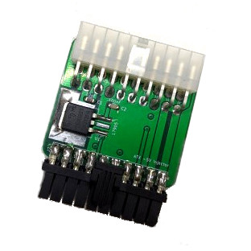

# ATX -5V inline injector

## Introduction

I needed a quick and cheap way to get -5V available on a modern ATX PSU. The current requirements were risible, so I just made an inline module that takes -12V and regulates down to -5V using a simple and cheap 7905.

### Disclaimer

I take NO responsibility for what happens if you decide to build and use this device. Your computer might crash, catch fire or be destroyed in other nasty ways.

## Bill of Materials

| Component         | Qty | Type / Value          |
| ----------------- | --- | --------------------- |
| J1                |  1  | Molex 39-30-1200      |
| J2                |  1  | Molex 172708-0020     |
| Pins for J2       |  20 | Molex 172718-1111     |
| U1                |  1  | 7905 (TO-263)         |
| C1                |  1  | 10uF/16v 1206 ceramic |
| C2                |  1  | 100nF 1206 ceramic    |

### Notes

Cut away the excess plastic from the Molex 172708-0020, fit in all the pins, and then slide the PCB between them. Then solder them, making sure they don't touch.
